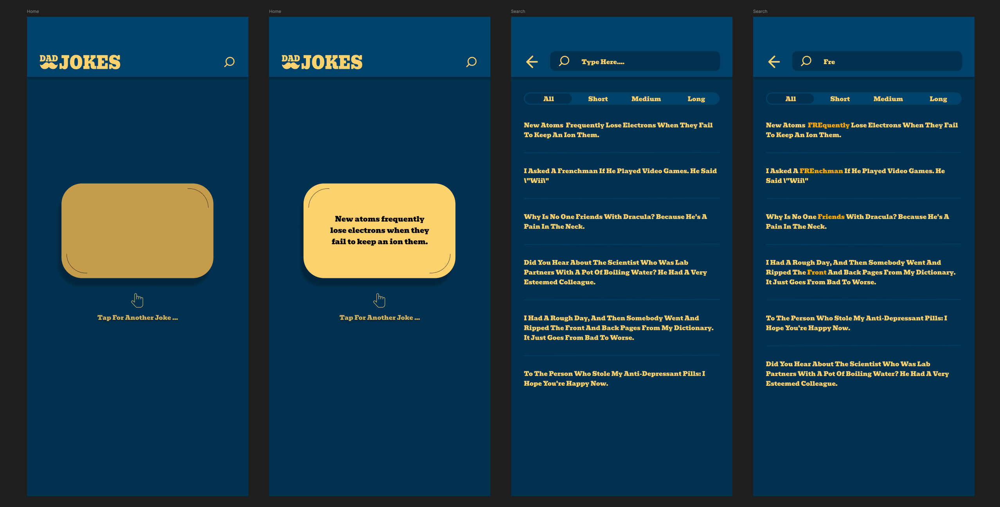

# Dad Jokes

Welcome to the repository for the React Frontend Developer Code Challenge! This project was developed to showcase an example of a code challenge for React frontend developers. The goal is to create a dynamic and interactive user interface that allows users to search for jokes and categorize them based on their length.


### Project Overview

This project demonstrates the implementation of a seamless and intuitive user interface that delivers relevant results efficiently. A prototype of the application is included to provide guidance on the expected user flow and design.


### Features

- **Search Functionality:** Users can input a search term to find jokes containing that term.
- **Result Highlighting:** The search term is emphasized in the results for easy identification.
- **Categorized Results are grouped by length:**
    - Short: Less than 10 words
    - Medium: 10 to 20 words
    - Long: More than 20 words

### Prototype

A prototype of the application is available in the [Figma](https://www.figma.com/design/40okkC6vt0kfTh9LfTvMcm/Dads-jokes?node-id=24-2). Use it as a reference to understand the expected user flow and design. The image below is a screenshot of the prototype. For a full interactive preview, [Full preview](https://www.figma.com/proto/40okkC6vt0kfTh9LfTvMcm/Dads-jokes?page-id=24%3A2&node-id=70-10&viewport=539%2C869%2C0.28&t=0TDj1nekxeuEAzWz-1&scaling=scale-down&content-scaling=fixed&starting-point-node-id=53%3A1085&show-proto-sidebar=1).



### Technologies Used

* : For building the user interface.
* : For styling the application.
* : For a fast development build and bundling tool.

---

# Detailed Descriptions and Personal Notes

The project will have 2 main functions:

1. Fetch a random joke.
2. Provide a way to search some jokes and grouping by math category. 
    Search Term rules:  
    Limit: 30 records.
    groups: short(<10), medium(>=10&<20), long(>=20&<30).


Nice to have: 
* way to save the jokes that the user like as favorite.

----------------------

* Steps:
    1. setup project using vite.
    2. setup styleguide using tailwind: 
        - PRIMARY: #01426A
        - PRIMARY_DARK: #003150
        - PRIMARY_HIGHLIGHT: #4A90E2
        - SECONDARY: #FDD16E
        - SECONDARY_DARK: #C49C4B
        - SECONDARY_HIGHLIGHT: #FFA500
    3. include svgs and assets that will need.
    4. setup enviroment envs.
        - API_URL: https://icanhazdadjoke.com
    5. setup deploy and app config on firebase.
    6. setup github action to apply deploy and validate build/lint...
    7. create config to setup variables about search term by group
        - SEARCH_TERM_GROUP_PATTERN: {
            "\<label\>": {
                min: number,
                max: number,
            }
        }
    8. create entities:
        - Joke
            ```typescript
                {
                    "id": string
                    "content": string
                }
            ```
    


*TODO: 

* services

- search-engine:
    - groupByPattern(pattern: SearchTermGroupPattern, data: Joke[]): Record<group_name, Joke[]>;
    - injectHighlightTerm(term: string, content: string): string;

- api: 
   - findeOne(random=true): Joke;
   - find(term=string): Joke[]

- cache: 
    localstorage will be used to save the data already fetched or searched.

* Componens:
    - header
        - variants: logo, actions both side. 

    - input
        - variants: with icon.
    
    - icon
        - variants: name to identify which icon will be render provided on assets/local.

    - Card
        - this card must be receive a text and the param to handle the internal animation state that will have a triggered behavior of flipping until the new state change.

    - tab-panel
        - basic tab panel with dynamic params as text and report fathers component the change state.

    - simple-list
        - variants: simple list must containt a divider on vertical.

* Page 
    - Home
        - header  
            - icon
            - search action
        - content
            - card
                - animation flip on tap
                - text
            - info
                - icon
                - detail
    - Search
        - header
            - back action
            - input term
        - content
            - tab-panel: patterns
            - simple-list

TODO: (PLUS)

Pages: 
    Favorite
